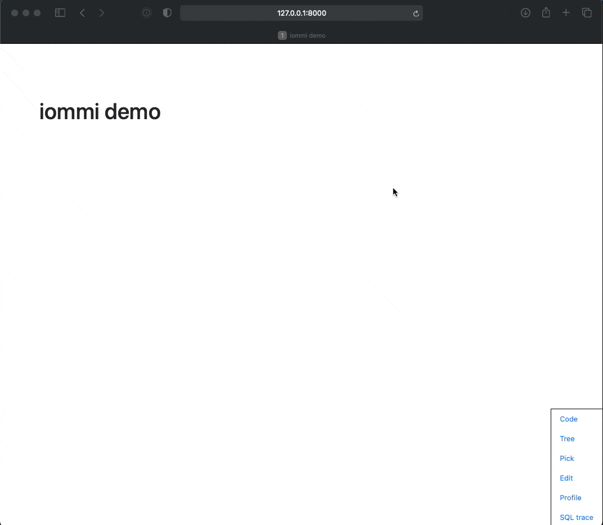

.. raw:: html

    

    <h3 class="pun">Your first pick for a django power cord</h3>

.. image:: https://img.shields.io/discord/773470009795018763?logo=discord&logoColor=fff?label=Discord&color=7389d8
    :target: https://discord.gg/ZyYRYhf7Pd

.. image:: https://github.com/TriOptima/iommi/workflows/tests/badge.svg
    :target: https://github.com/TriOptima/iommi/actions?query=workflow%3Atests+branch%3Amaster

.. image:: https://codecov.io/gh/TriOptima/iommi/branch/master/graph/badge.svg
    :target: https://codecov.io/gh/TriOptima/iommi

.. image:: https://readthedocs.org/projects/iommi/badge/?version=latest
    :target: https://docs.iommi.rocks
    :alt: Documentation Status

.. image:: https://repl.it/badge/github/boxed/iommi-repl.it
    :target: https://repl.it/github/boxed/iommi-repl.it

iommi is a toolkit to build web apps faster. It's built on Django but goes a lot further.

It has:

- `forms <https://docs.iommi.rocks/en/latest/forms.html>`_: that feel familiar, but can handle growing complexity better than Djangos forms
- `tables <https://docs.iommi.rocks/en/latest/tables.html>`_: that are powerful out of the box and scale up to arbitrary complexity
- a system to `compose parts <https://docs.iommi.rocks/en/latest/pages.html>`_:, like forms, menus, and tables, into bigger pages
- tools that will speed up your development like live edit, jump to code, great feedback for missing select/prefetch related, a profiler, and more.
- great error messages when you make a mistake

Example:

.. code:: python

    class IndexPage(Page):
        title = html.h1('Supernaut')
        welcome_text = 'This is a discography of the best acts in music!'

        artists = Table(auto__model=Artist, page_size=5)
        albums = Table(
            auto__model=Album,
            page_size=5,
        )
        tracks = Table(auto__model=Album, page_size=5)

    urlpatterns = [
        path('', IndexPage().as_view()),
    ]

This creates a page with three separate tables, a header and some text:

.. image:: docs/README-screenshot.png

For more examples, see the `examples project <https://github.com/TriOptima/iommi/tree/master/examples/examples>`_.

Usage
------

See `usage <https://docs.iommi.rocks/en/latest/usage.html>`_.

Running tests
-------------

You need to have tox installed then:

.. code::

    make venv
    source env/bin/activate
    make test
    make test-docs

License
-------

BSD

Documentation
-------------

https://docs.iommi.rocks
