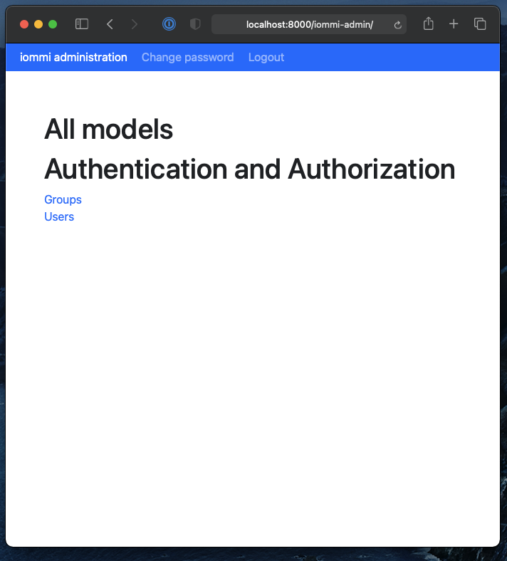

.. imports
    from django.contrib.auth.models import User
    import pytest
    pytestmark = pytest.mark.django_db

Admin
=====

The powerful abstractions of iommi enable us to build an admin interface
that is automagically created based on your models, while retaining the full
feature set of iommi.

Installation
~~~~~~~~~~~~

First declare a subclass of `Admin`:

.. code-block:: python

    from iommi.admin import Admin

    class MyAdmin(Admin):
        pass

This is the place you will put configuration. If you don't need any you
can skip this step. Next plug it into your urls:

.. code-block:: python

    urlpatterns = [
        # ...

        path('iommi-admin/', include(MyAdmin.urls())),
    ]

Now you have the iommi admin gui for your app!

Customization
~~~~~~~~~~~~~

Add a model to the admin
------------------------

You can add an app to your admin from your global config like this:

.. code-block:: python

    class MyAdmin(Admin):
        class Meta:
            apps__myapp_mymodel__include = True

This is especially useful for adding config to a third party app that doesn't have built in iommi admin configuration.

You can also add the config in the app, by creating a `iommi_admin.py` file in your app, and putting the configuration there:

.. code-block:: python

    class Meta:
        apps__myapp_mymodel__include = True

Remove a model from the admin
-----------------------------

By default iommi displays the built in Django `User` and `Group` models. You can override this like:

.. code-block:: python

    class MyAdmin(Admin):
        class Meta:
            apps__auth_user__include = False

This turns off the admin of the `User` table in the `auth` app. Your global config always has priority.

Permissions
-----------

By default staff users have access to the admin. You can change this by
overriding `has_permission`:

.. code-block:: python

    from iommi.admin import Admin

    class MyAdmin(Admin):
        @staticmethod
        def has_permission(request, operation, model=None, instance=None):
            # This is the default implementation
            return request.user.is_staff

.. test
    assert Admin.has_permission  # validate that we haven't changed the API of Admin too badly
    assert MyAdmin.has_permission(staff_req('get'), None, None, None)

`operation` is one of `create`, `edit`, `delete`, `list` and `all_models`. The
`model` parameter will be given for create/edit/delete/list, and instance will
be supplied in edit/delete.

HTML attributes
---------------

You can configure attributes in the admin similarly to the rest of iommi, on
the `Meta` class:

.. code-block:: python

    class MyAdmin(Admin):
        class Meta:
            parts__all_models__columns__model_name__cell__attrs__style__background = 'black'

The easiest way to find the path for configuration is to have
`settings.IOMMI_DEBUG` turned on (by default on if `DEBUG` is on), and use
the pick feature and click on the element. You'll get the path and also
the type so you can click your way to the documentation for that class.

In the example above the `data-iommi-path` would be
`parts__all_models__columns__model_name__cell` and `data-iommi-type` is
:doc:`Cell`. In the docs for `Cell` you can find that cells have `attrs`.
