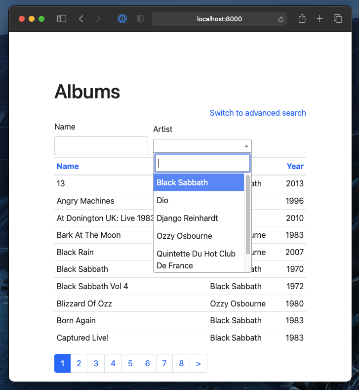
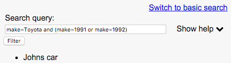

Queries
=======

iommi queries makes it easy to implement searching and filtering in your Django app.

Major features:

- Generate simple filtering GUIs
- Supply your views with an advanced query language
- Query language can be used stand alone without the GUI parts
- Highly customizable GUI based on iommi :doc:`forms`

Queries are normally used from inside iommi tables where they are an
integrated part, but can also be used stand alone. See below for an
example.

The code for the example above:

.. code-block:: python

    Table(
        auto__model=Album,
        page_size=10,
        columns__name__filter__include=True,
        columns__artist__filter__include=True,
    )

Read the full documentation and the :doc:`cookbook` for more.

    

Query language
--------------

iommi comes with an advanced query language so users can filter tables
after what they want. Searching songs can look like this:

.. code-block::

    album=Paranoid AND lyrics:"have the power"

This will find the song War Pigs, as it's from the album Paranoid and
the lyrics contains the text "have the power". The query language supports
`AND` and `OR`, parenthesis and the operations `<`, `<=`, `>`, `>=` for
numerical values, and `=` for all values which is an exact case insensitive
match. You can exclude with `!=`. As the example above shows `:` is used for
case insensitive "contains" queries, and the inverse of that is `!:`.

iommi tries to support what the user might intuitively write for searching
boolean columns. It will interpret "n", "no", "0" (zero), "false", "f" and "off"
as `false`  and the corresponding values for `true`.

You can configure a `Filter` to be case sensitive by setting `query_operator_to_q_operator`
to `case_sensitive_query_operator_to_q_operator`.

iommi queries have a special form for filtering directly on pk, which can be
very handy: `album.pk=3`.

`query_operator_for_field` specifies what operation the simple form uses to
interpret its inputs. The default is `=`, meaning exact case insensitive match.

If you have table of `Song` and a foreign key to `Album`, if you search for
`album=Paranoid` iommi will by default create the Django query
`Q(album__name='Paranoid')`. If your model has different fields used as names,
you must register those with `register_search_fields`, or if you want
something other special for just this view you can use the `search_fields`
parameter to specify the fields to use. Note that you can use `pk` or
other non-string columns as search fields if you want.

    

Stand alone example
-------------------

Simple view that allows the user to search for a car by choosing the make from a drop down, and search
for specific model in the advanced mode:

.. code-block:: python

    class CarQuery(Query):
        make = Filter.choice(choices=['Toyota', 'Volvo', 'Ford'])
        model = Filter.text()

    def cars(request):
        query = CarQuery().bind(request=request)
        cars_query_set = query.get_q()
        return render(
            request=request,
            template_name='cars.html',
            context={
                'query': query,
                'cars': cars_query_set,
            },
        )

.. code-block:: html

    <!-- cars.html -->
    {{ query }}

    <ul>
        
            <li>{{ car }}</li>
        
    </ul>
    
You will also need to render the assets in your `<head>` tag:

.. code-block:: html
    
    
        {{ asset }}
    

.. image:: simple_gui.png

After switching to the advanced mode:

Programmatically call the search API:

.. code-block:: python

    query = CarQuery().bind(request=request)
    cars_query_set = query.parse_query_string(
        'make=Toyota and (make=1991 or make=1992)'
    )
