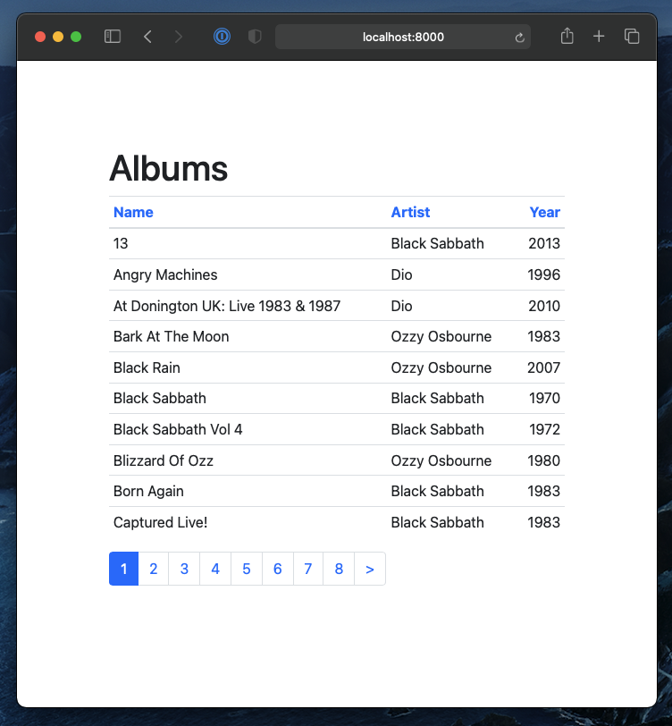

.. imports
    def fill_dummy_data(): pass

Tables
======

iommi tables makes it easy to create full featured HTML tables easily:

* generates header, rows and cells
* sorting
* filtering
* pagination
* bulk edit
* link creation
* customization on multiple levels, all the way down to templates for cells
* automatic rowspan
* grouping of headers

The code for the example above:

.. code:: python

    Table(
        auto__model=Album,
        page_size=10,
    )

Read the full documentation and the :doc:`cookbook` for more.

Creating tables from models
---------------------------

Say I have some model:

.. test

    class Foo(models.Model):
        a = models.IntegerField()

        def __str__(self):
            return f'Foo: {self.a}'

.. test
        class Meta:
            app_label = 'docs_tables'
    assert str(Foo(a=7)) == 'Foo: 7'

.. code:: python

    class Bar(models.Model):
        b = models.ForeignKey(Foo, on_delete=models.CASCADE)
        c = models.CharField(max_length=255)

.. test
        class Meta:
            app_label = 'docs_tables'

Now I can display a list of `Bar` in a table like this:

.. code:: python

    def my_view(request):
        return Table(auto__model=Bar)

.. test
    my_view(req('get'))

This automatically creates a table with pagination and sorting. If you pass
`query_from_indexes=True` you will get filters for all the model fields
that have database indexes. This filtering system includes an advanced filter
language. See :doc:`queries` for more on filtering.

Explicit tables
---------------

You can also create tables explicitly:

.. code:: python

    def albums(request):
        class AlbumTable(Table):
            # Shortcut for creating checkboxes to select rows
            select = Column.select()

            # Show the name field from Artist. This works for plain old objects too.
            artist_name = Column.number(
                attr='artist__name',

                # put this field into the query language
                filter__include=True,
            )
            year = Column(
                # Enable bulk editing for this field
                bulk__include=True,
            )

        return AlbumTable(rows=Artist.objects.all())

.. test
    albums(req('get'))

This gives me a view with filtering, sorting, bulk edit and pagination.

Table of plain python objects
-----------------------------

.. code:: python

    def plain_objs_view(request):
        # Say I have a class...
        class Foo(object):
            def __init__(self, i):
                self.a = i
                self.b = 'foo %s' % (i % 3)
                self.c = (i, 1, 2, 3, 4)

        # and a list of them
        foos = [Foo(i) for i in range(4)]

        # I can declare a table:
        class FooTable(Table):
            a = Column.number()

            b = Column()

            # Display the last value of the tuple
            c = Column(
                cell__format=lambda value, **_: value[-1],
            )

            # Calculate a value not present in Foo
            sum_c = Column(
                cell__value=lambda row, **_: sum(row.c),
                sortable=False,
            )

        # now to get an HTML table:
        return FooTable(rows=foos)

.. test
    plain_objs_view(req('get'))

All these examples and a bigger example using many more features can be found in the examples project.
